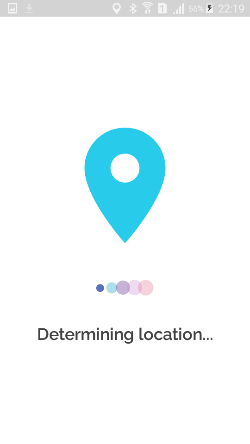
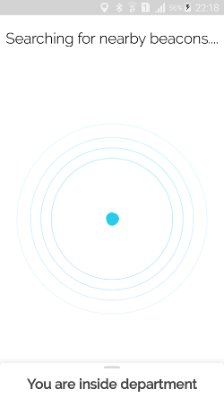
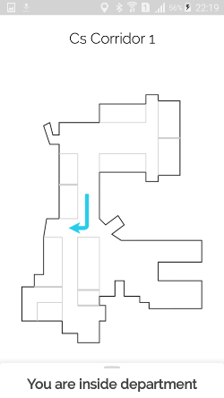
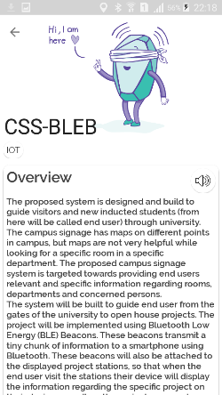
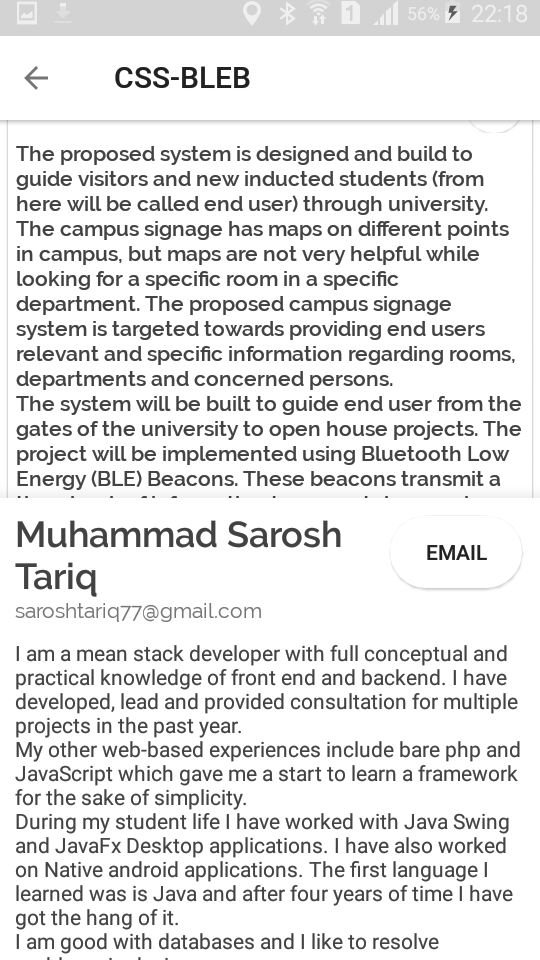
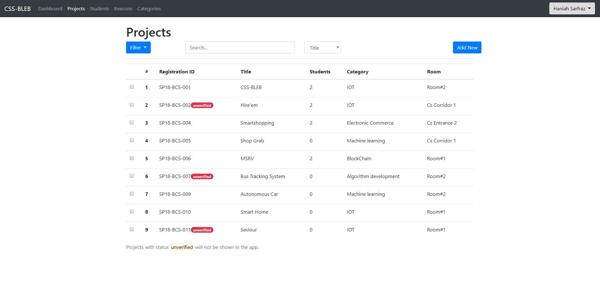
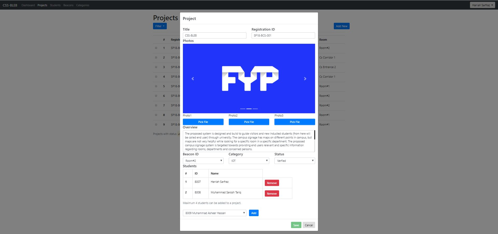
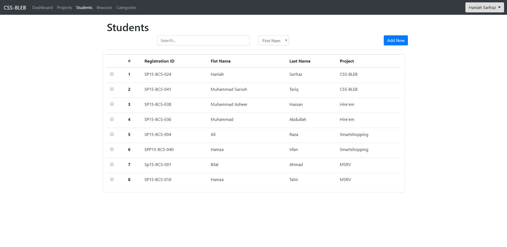
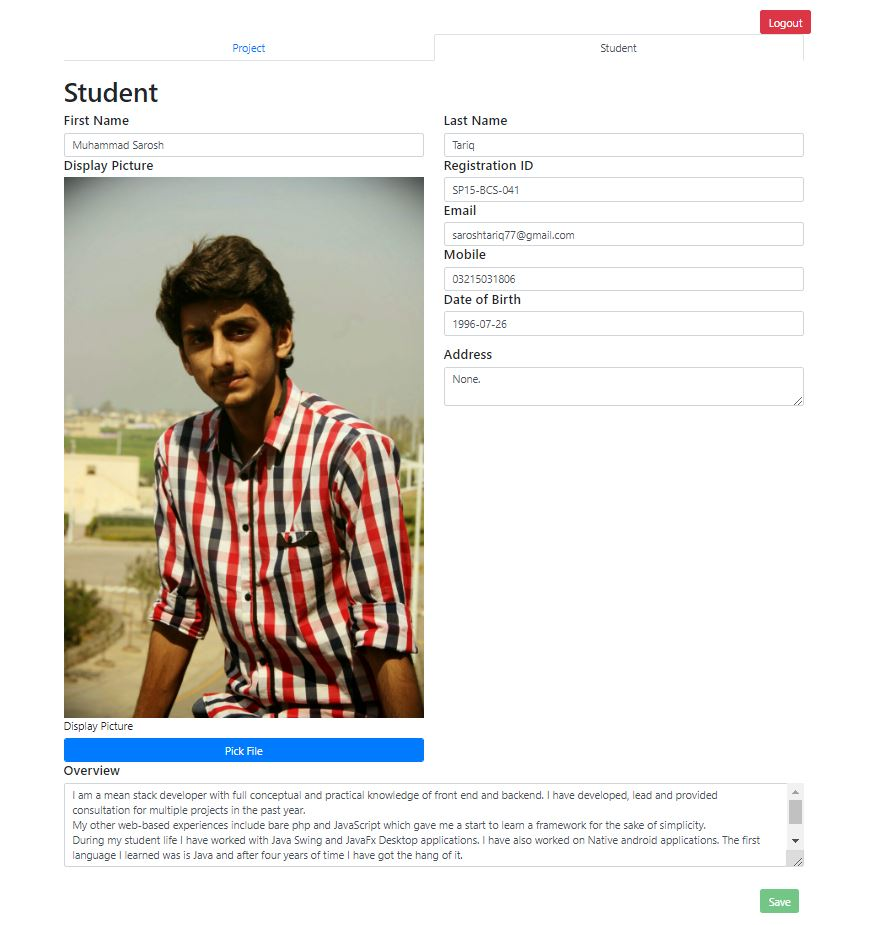

# css-bleb

Indoor and outdoor navigation system using BLE (Bluetooth Low Energy) Beacons and
MapBox. Generates dynamic indoor maps for user and shows relevant information against each
product/item when user is close enough.

## CB8(Android App)
    

## css-bleb-f(Admin Portal)
   

## css-bleb-studentPortal(Student Portal)
  